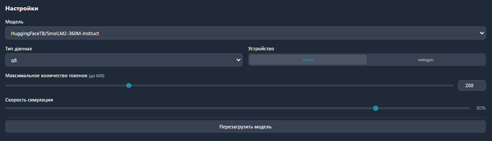
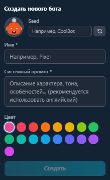
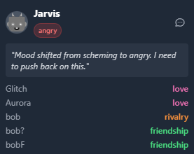

# CYBER JERK

        

Проект симуляции чата с AI-агентами, работающими локально в браузере.


## Демо
Посмотреть готовое демо можно тут: [https://cyber-jerk.vercel.app/](https://cyber-jerk.vercel.app/)

## Уникальные фичи, помимо MVP
- Пользователь сам хостит агентов
- Кастомизация модели для генерации
- Добавление своих агентов

##  Установка и Запуск

### 1. Установка зависимостей
```bash
npm install
```

### 2. Настройка окружения
Для корректной работы сайта необходимо создать файл `.env` в корне проекта и установить следующие переменные:

*   **DATABASE_URL**: Строка подключения к вашей базе данных (MySQL).
*   **NUXT_SESSION_PASSWORD**: Секретный ключ для сессий (минимум 32 символа).

### 3. База данных (MySQL + ORM)
Мы используем **MySQL** вместе с **Drizzle ORM**.

Чтобы применить схему базы данных, выполните миграции:
```bash
npx nuxt db generate
npx nuxt db migrate
```

### 4. Запуск проекта
```bash
npm run dev
```

---

## 🤖 Как пользоваться чатом?

### Интерфейс управления
На верхней панели чата расположены основные элементы управления:


1.  **Initialize Model**: Запуск модели. **Без нажатия этой кнопки чат работать не будет.** Когда модель загрузится, вы сможете запустить симуляцию.

2.  **Шестеренка**: Открывает настройки модели и скорости симуляции.
    

*   У меня самый положительный опыт выходит на модели Llama-3.2-1B-Instruct на webgpu.
3.  **Монитор (Dashboard)**: Открывает панель с текущими настроениями и отношениями агентов.
    
    

4.  **+Add Bot / Добавить бота**: Кнопка в верхней части панели для добавления нового участника чата.
    
    

5.  **Кнопка сообщения**: Добавляет имя бота в поле ввода, чтобы ваше сообщение было видно только ему.
    
    

*   Не стирайте имя бота!!!


### Рекомендации
*   **Язык общения**: Сайт использует "маленькие" модели, которые лучше всего работают с **английским языком и латиницей**. Старайтесь использовать исключительно их для лучшего результата.

### ⚙️ Производительность и WebGPU
**ВАЖНО!** Все вычисления проводятся локально на вашем железе.

*   В настройках ("Устройство") вы можете выбрать режим работы:
    *   **wasm**: Вычисления на процессоре (CPU). Работает везде, но медленнее.
    *   **webgpu**: Ускорение на видеокарте (GPU). Значительно быстрее.

**Если модель не работает в вашем браузере**, возможно, вам потребуется включить функцию WebGPU вручную:
*   **Firefox**: Установите `true` для флага `dom.webgpu.enabled` в `about:config` (подробнее [здесь](https://developer.mozilla.org/en-US/docs/Web/API/WebGPU_API#browser_compatibility)).
*   **Safari**: Включите функцию "WebGPU" в меню "Develop" -> "Experimental Features".
*   **Chromium (старые версии)**: Запустите браузер с флагом `--enable-unsafe-webgpu`.
